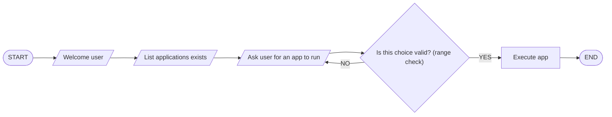
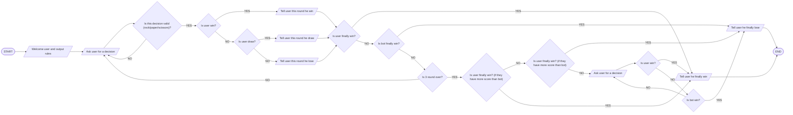

# Simple 简

## main.py

### Flowchart

```mermaid
flowchart LR
    start([START])
    start --> welcome[/Welcome user/]
    welcome --> list_app[/List applications exists/]
    list_app --> ask_for_app[/Ask user for an app to run/]
    ask_for_app --> check{"Is this choice valid? (range check)"}
    check --NO--> ask_for_app
    check --YES--> execute["Execute app"]
    execute --> END([END])
```

## rock_paper_scissors.py

### Flowchart

```mermaid
flowchart LR
    start([START])
    start --> welcome[/Welcome user and output rules/]
    welcome --> ask_dec[/Ask user for a decision/]
    ask_dec --> check{"Is this decision valid (rock/paper/scissors)?"}
    check -- NO --> ask_dec
    check -- YES --> winorn{"Is user win?"}
    winorn -- YES --> congr[/Tell user this round he win/]
    winorn -- NO --> isdraw{"Is user draw?"}
    isdraw -- YES --> draw[/Tell user this round he draw/]
    isdraw -- NO --> loseround[/Tell user this round he lose/]
    draw --> isuserwin{"Is user finally win?"}
    congr --> isuserwin
    loseround --> isuserwin
    isuserwin -- YES --> final_win[/Tell user he finally win/]
    isuserwin -- NO --> isbotwin{"Is bot finally win?"}
    isbotwin -- YES --> final_lose[/Tell user he finally lose/]
    isbotwin -- NO --> is3ro{"Is 3 round over?"}
    is3ro -- NO --> ask_dec
    is3ro -- YES --> isusermore{"Is user finally win? (if they have more score than bot)"}
    isusermore -- NO --> isbotmore{"Is user finally win? (if they have more score than bot)"}
    isusermore -- YES --> final_win
    isbotmore -- YES --> final_lose
    isbotmore -- NO --> rematch[/Ask user for a decision/]
    rematch --> isuw{Is user win?}
    isuw -- YES --> final_win
    isuw -- NO --> isbw{Is bot win?}
    isbw -- YES --> final_lose
    isbw -- NO --> rematch
    final_win --> END([END])
    final_lose --> END([END])
```

## where_is_my_teacher.py

### Flowchart

```mermaid
flowchart LR
    start([START])
    start --> welcome[/Welcome user and introduce this app/]
    welcome --> ask_name[/Ask user for teacher's name/]
    ask_name --> check_name{"Is name not empty?"}
    check_name -- NO --> invalid[/Tell user this input is invalid/]
    invalid --> ask_name
    check_name -- YES --> fetch_teachers["Fetch relevant teachers name and link from SCIE Names"]
    fetch_teachers --> ask_choice[/Show list of relevant teachers and ask for choice/]
    ask_choice --> check_choice{"Is choice valid? (range check)"}
    check_choice -- NO --> invalid_choice[/Tell user this choice is invalid/]
    invalid_choice --> ask_choice
    check_choice -- YES --> fetch_timetable["Fetch the teacher's timetable from SCIE Names"]
    fetch_timetable --> determine["Determine what's the period now and select it from timetable datas"]
    determine --> is_now_ex{"Is there datas about the period now?"}
    is_now_ex -- NO --> tell_no_now[/Tell user we can't identify where the teacher is now/]
    is_now_ex -- YES --> output_classroom[/Process period datas and output the classroom where the teacher is/]
    tell_no_now --> filter["Filter periods after now (according to the timetable the teacher will be there)"]
    output_classroom --> filter
    filter --> output_predict[/"Output the period name and classroom of those periods"/]
    output_predict --> END
    END([END])
```
